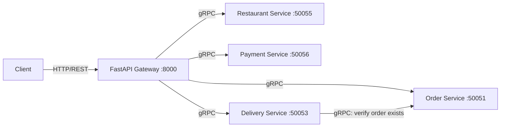

# Restaurant Microservices Platform

A food-ordering backend built as a set of independent Python microservices — **Order**, **Restaurant**, **Payment**, and **Delivery** — that talk to each other over **gRPC**, fronted by a **FastAPI** gateway that exposes a single REST API to clients. Built to practice service decomposition, protobuf contract design, and containerised deployment (Docker Compose locally, Kubernetes manifests for a cluster).

## Architecture



- **API Gateway** (`services/fastapi_bonus.py`) — the only HTTP entry point. Translates REST calls into gRPC requests against the four backend services and returns JSON.
- **Order Service** — creates orders, tracks status, and answers "does this order exist?" checks from the Delivery service.
- **Restaurant Service** — serves and updates restaurant menus, records order accept/reject decisions.
- **Payment Service** — processes payments and reports payment status per order.
- **Delivery Service** — assigns a driver from a fixed pool, tracks delivery status, and calls back into the Order service via gRPC to confirm an order is valid before assigning it.

Each service is a standalone gRPC server with its own `.proto` contract (in `protos/`) and generated stubs (in `pb2/`), so any service can be developed, tested, or redeployed independently of the others.

## Tech Stack

- **Python** (3.9 in containers, 3.12 for local venv)
- **gRPC + Protocol Buffers** for inter-service contracts and communication
- **FastAPI** + **Uvicorn** for the REST gateway
- **Docker** / **Docker Compose** for local multi-container orchestration
- **Kubernetes** manifests for cluster deployment

## Project Layout

```
services/       gRPC servers + the FastAPI gateway
protos/         .proto contracts for each service
pb2/            generated gRPC/protobuf stubs
docker/         one Dockerfile per service
kubernetes/     Deployment + Service manifests per service
clients/        end-to-end test client
docker-compose.yml
```

## Getting Started

### Prerequisites
- Python 3.9+ and `pip`
- Docker & Docker Compose (for the containerised option)

### Option A — run locally in a virtualenv
```bash
git clone <this-repo-url>
cd restaurant-microservices-platform

python -m venv venv
source venv/bin/activate      # Windows: venv\Scripts\activate

pip install -r requirements.txt
```

Then open five terminals (one per service) and run:
```bash
python services/order_service.py
python services/restaurant_service.py
python services/payment_service.py
python services/delivery_service.py
python services/fastapi_bonus.py
```

### Option B — run with Docker Compose (recommended)
```bash
docker compose up --build -d
```
This builds and starts all five services, with `wait-for-it.sh` making sure each service doesn't start until the Order service (which the others depend on) is reachable.

## Using the API

Once the gateway is up on `http://localhost:8000`, a typical order flow looks like:

**1. View a restaurant's menu**
```bash
curl -X GET "http://localhost:8000/menu/Restaurant1"
```

**2. Place an order**
```bash
curl -X POST "http://localhost:8000/order?buyer_id=Daniel&vendor_id=Restaurant1"
```

**3. Check order status** (use the `order_id` returned above)
```bash
curl -X GET "http://localhost:8000/order/ORD1234/status"
```

**4. Assign a driver**
```bash
curl -X POST "http://localhost:8000/delivery/assign?order_id=ORD1234"
```

**5. Update delivery status**
```bash
curl -X PUT "http://localhost:8000/delivery/ORD1234/status?status=DELIVERED"
```

**6. Pay for the order**
```bash
curl -X POST "http://localhost:8000/payment?payer_id=Daniel&order_id=ORD1234&amount=25.0&method=credit_card"
```

**7. Check payment status**
```bash
curl -X GET "http://localhost:8000/payment/ORD1234/status"
```

## Running the Test Client

`clients/test_client.py` drives the full order → payment → delivery lifecycle straight over gRPC (bypassing the REST gateway) and prints the result of each step — useful as a quick smoke test that every service is wired up correctly.

```bash
python clients/test_client.py
```
Works against either the manually-started services or the Docker Compose stack — it reads a `RUNNING_IN_DOCKER` environment variable to decide which hostnames to use.

## Kubernetes Deployment (optional)

Deployment + Service manifests for all five services are in `kubernetes/manifests/`. They currently reference pre-built images on Docker Hub, so to deploy to your own cluster, build and push your own images first and update the `image:` field in each `*-deploy.yml` accordingly:

```bash
docker build -t <your-registry>/order-service:latest -f docker/order.Dockerfile .
docker push <your-registry>/order-service:latest
# ...repeat for restaurant, payment, delivery, fastapi-bonus

kubectl apply -f kubernetes/manifests/
```

## Metrics (optional)

The gateway pushes basic response-time metrics for each endpoint to a Graphite listener on `localhost:2003` (Carbon plaintext protocol). This is best-effort: if nothing is listening on that port, the send silently no-ops and the request still completes normally.

## Design Notes & Limitations

This project prioritises demonstrating clean service boundaries and gRPC contracts over production-readiness. Worth knowing going in:

- **In-memory storage** — each service keeps its state in a plain Python dict, so data is lost on restart. A production version would give each service its own database, in keeping with the microservices principle of independent data ownership.
- **No auth or TLS** — gRPC channels are insecure and the REST gateway has no auth layer; fine for local development, not something to expose publicly as-is.
- **Random driver assignment** — the Delivery service picks a driver at random from a fixed pool of three, as a stand-in for real dispatch logic.

## Possible Next Steps

- Persistent storage per service (e.g. Postgres per service, or SQLite for a lighter first step)
- AuthN/AuthZ on the gateway
- Event-driven communication (e.g. RabbitMQ/Kafka) between services instead of synchronous gRPC calls where it makes sense (e.g. order-status change notifications)
- CI pipeline to build, test, and push images automatically on merge
